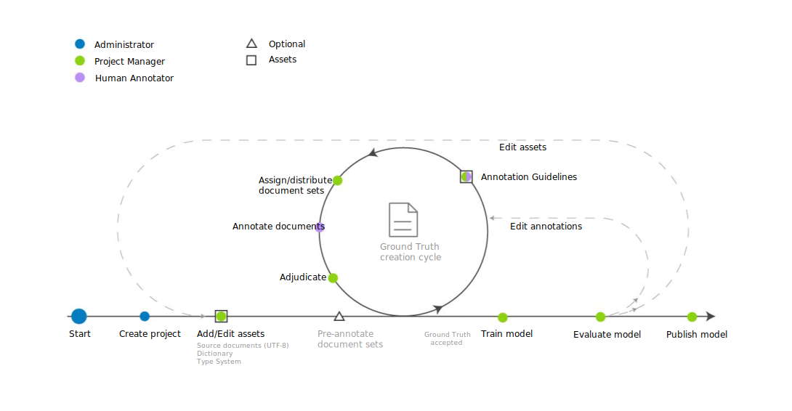

---

copyright:
  years: 2015, 2019
lastupdated: "2019-07-16"

subcollection: watson-knowledge-studio

---

{:shortdesc: .shortdesc}
{:new_window: target="_blank"}
{:tip: .tip}
{:pre: .pre}
{:codeblock: .codeblock}
{:screen: .screen}
{:javascript: .ph data-hd-programlang='javascript'}
{:java: .ph data-hd-programlang='java'}
{:python: .ph data-hd-programlang='python'}
{:swift: .ph data-hd-programlang='swift'}

This documentation is for {{site.data.keyword.knowledgestudiofull}} on {{site.data.keyword.cloud}}. To see the documentation for the previous version of {{site.data.keyword.knowledgestudioshort}} on {{site.data.keyword.IBM_notm}} Marketplace, [click this link ](https://{DomainName}/docs/services/knowledge-studio/ml-annotator.html){: new_window}.
{: tip}

# Machine learning model creation workflow
{: #ml_annotator}

Create a machine learning model that trains a model you can use to identify entities, coreferences, and relationships of interest in new documents.
{: shortdesc}

Understand the typical workflow for creating a machine learning model in {{site.data.keyword.knowledgestudioshort}}.

All the steps are performed by the project manager, except for the *Annotate documents* step, which is performed by the human annotator. Because human annotators are often subject matter experts, they might be consulted during the creation of workspace resources, such as the type system, also.

 Figure 1. The workflow for developing a machine learning model

<table summary="Creating and refining a model">
  <caption>Table 1. Creating and refining a workflow</caption>
  <tr>
    <th style="vertical-align:bottom; text-align:left" id="d14771e70">Step</th>
    <th style="vertical-align:bottom; text-align:left" id="d14771e72">Description</th>
  </tr>
  <tr>
    <td style="vertical-align:top; text-align:left" headers="d14771e70">
      
Create a workspace.

    </td>
    <td style="vertical-align:top; text-align:left" headers="d14771e72">
      
See [Creating a workspace](/docs/services/watson-knowledge-studio?topic=watson-knowledge-studio-create-project). A workspace contains the resources that are used to create the model, including:

      <dl>
        <dt>Type system</dt>
        <dd>
          
Upload or create the type system, and define the entity types and relation types that human annotators can apply when annotating text. The model process manager typically works with subject matter experts for your domain to define the type system. See [Establishing a type system](/docs/services/watson-knowledge-studio?topic=watson-knowledge-studio-typesystem)

        </dd>
        <dt>Source documents</dt>
        <dd>
          
Create a corpus by uploading sample documents that are representative of your domain content into the workspace. See [Adding documents for annotation](/docs/services/watson-knowledge-studio?topic=watson-knowledge-studio-documents-for-annotation). Partition the corpus into document sets, specify the percentage of documents that are shared among all document sets, and assign the document sets to human annotators. See [Creating and assigning annotation sets](/docs/services/watson-knowledge-studio?topic=watson-knowledge-studio-documents-for-annotation#wks_projdocsets).

        </dd>
        <dt>Dictionaries</dt>
        <dd>
          
Upload or create dictionaries for annotating text. You can choose to manually add dictionary entries or upload entries from a file, and then edit the entries. See [Creating dictionaries](/docs/services/watson-knowledge-studio?topic=watson-knowledge-studio-dictionaries).

        </dd>
      </dl>
    </td>
  </tr>
  <tr>
    <td style="vertical-align:top; text-align:left" headers="d14771e70">
      
<strong>Optional</strong>: Pre-annotate documents

    </td>
    <td style="vertical-align:top; text-align:left" headers="d14771e72">
      
Pre-annotate documents according to the terms in the workspace dictionaries, mentions of {{site.data.keyword.nlushort}} types, or based on rules that you define. See [Bootstrapping annotation](/docs/services/watson-knowledge-studio?topic=watson-knowledge-studio-preannotation).

    </td>
  </tr>
  <tr>
    <td style="vertical-align:top; text-align:left" headers="d14771e70">
      
Annotate documents

    </td>
    <td style="vertical-align:top; text-align:left" headers="d14771e72">
      <ol>
        <li>
          
Admins and project managers can annotate documents directly, without needing to create annotation tasks or go through the adjudication process. See [Annotating document sets directly](/docs/services/watson-knowledge-studio?topic=watson-knowledge-studio-annotating-document-sets-directly).

        </li>
        <li>
          
The project manager generally assigns annotation tasks to human annotators, configures the inter-annotator agreement threshold, and provides annotation guidelines for the human annotators to follow. See [Creating an annotation task](/docs/services/watson-knowledge-studio?topic=watson-knowledge-studio-annotate-documents#wks_hatask).

        </li>
        <li>
          
Human annotators use the ground truth editor to manually annotate documents. A human annotator identifies mentions of interest in your domain content and labels them with entity types. The human annotator also identifies relationships between mentions (for example, Mary is an employee of IBM) and how the mentions co-reference the same entity (such as an occurrence of "she" that refers to Mary). Refer to [Annotating documents](/docs/services/watson-knowledge-studio?topic=watson-knowledge-studio-user-guide).

        </li>
      </ol>
    </td>
  </tr>
  <tr>
    <td style="vertical-align:top; text-align:left" headers="d14771e70">
      
Adjudicate and promote documents

    </td>
    <td style="vertical-align:top; text-align:left" headers="d14771e72">
      
Accept or reject the ground truth that was generated by human annotators, and adjudicate any annotation differences to resolve conflicts. Evaluating the accuracy and consistency of the human annotation effort might be the responsibility of a senior human annotator or a user with stronger subject matter experience than the project manager. See [Adjudication](/docs/services/watson-knowledge-studio?topic=watson-knowledge-studio-build-groundtruth#wks_haperform).

    </td>
  </tr>
  <tr>
    <td style="vertical-align:top; text-align:left" headers="d14771e70">
      
Train the model

    </td>
    <td style="vertical-align:top; text-align:left" headers="d14771e72">
      
Create the machine learning model. See [Creating a machine learning model](/docs/services/watson-knowledge-studio?topic=watson-knowledge-studio-train-ml#wks_madocsets).

    </td>
  </tr>
  <tr>
    <td style="vertical-align:top; text-align:left" headers="d14771e70">
      
Evaluate the model.

    </td>
    <td style="vertical-align:top; text-align:left" headers="d14771e72">
      
Evaluate the accuracy of the model. See [Evaluating annotations added by the model](/docs/services/watson-knowledge-studio?topic=watson-knowledge-studio-train-ml#wks_matest). Depending on model accuracy, this step might result in the need to repeat earlier steps again and again until optimal accuracy is achieved. See [Analyzing machine learning model performance](/docs/services/watson-knowledge-studio?topic=watson-knowledge-studio-evaluate-ml) for ideas about what to update based on common performance issues.

    </td>
  </tr>
  <tr>
    <td style="vertical-align:top; text-align:left" headers="d14771e70">
      
Publish the model.

    </td>
    <td style="vertical-align:top; text-align:left" headers="d14771e72">
      
Export or deploy the model. See [Using the machine learning model](/docs/services/watson-knowledge-studio?topic=watson-knowledge-studio-publish-ml).

    </td>
  </tr>
</table>
